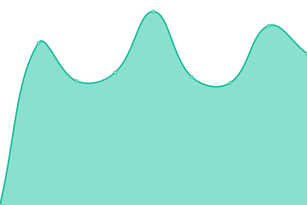

# [📈 Live Status](https://status.tetragg.com): <!--live status--> **🟥 Complete outage**

This repository contains the open-source uptime monitor and status page for [Thomas Delecroix](https://status.tetragg.com), powered by [Upptime](https://github.com/upptime/upptime).

With [Upptime](https://upptime.js.org), you can get your own unlimited and free uptime monitor and status page, powered entirely by a GitHub repository. We use [Issues](https://github.com/TetraGG/upptime/issues) as incident reports, [Actions](https://github.com/TetraGG/upptime/actions) as uptime monitors, and [Pages](https://status.tetragg.com) for the status page.

<!--start: status pages-->
<!-- This summary is generated by Upptime (https://github.com/upptime/upptime) -->
<!-- Do not edit this manually, your changes will be overwritten -->
<!-- prettier-ignore -->
| URL | Status | History | Response Time | Uptime |
| --- | ------ | ------- | ------------- | ------ |
|  [Proxy](https://proxy.tetragg.com) | 🟥 Down | [proxy.yml](https://github.com/TetraGG/Upptime/commits/HEAD/history/proxy.yml) | 

 813ms
     
 | 

<a href="https://status.tetragg.com/history/proxy">75.37%</a>
    

|  [Proxmox](https://pve.tetragg.com) | 🟥 Down | [proxmox.yml](https://github.com/TetraGG/Upptime/commits/HEAD/history/proxmox.yml) | 

 754ms
     
 | 

<a href="https://status.tetragg.com/history/proxmox">76.16%</a>
    

|  [Jellyfin](https://jellyfin.tetragg.com) | 🟥 Down | [jellyfin.yml](https://github.com/TetraGG/Upptime/commits/HEAD/history/jellyfin.yml) | 

 869ms
     
 | 

<a href="https://status.tetragg.com/history/jellyfin">77.87%</a>
    

|  [Nextcloud](https://nextcloud.tetragg.com) | 🟥 Down | [nextcloud.yml](https://github.com/TetraGG/Upptime/commits/HEAD/history/nextcloud.yml) | 

 1140ms
     
 | 

<a href="https://status.tetragg.com/history/nextcloud">74.43%</a>
    

<!--end: status pages-->

[**Visit our status website →**](https://status.tetragg.com)

## 📄 License

- Powered by: [Upptime](https://github.com/upptime/upptime)
- Code: [MIT](./LICENSE) © [Thomas Delecroix](https://status.tetragg.com)
- Data in the `./history` directory: [Open Database License](https://opendatacommons.org/licenses/odbl/1-0/)
